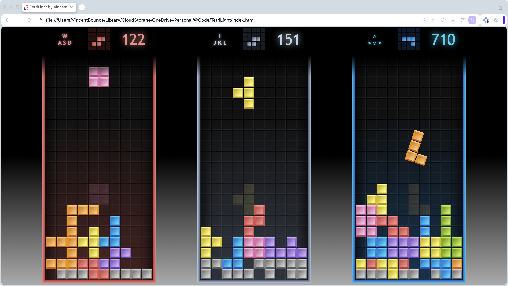

# 🧱TetriLight - JS 3-player Tetris on the same monitor

HTML5/JavaSript/Canvas | Resizable | Animated | Offline | 100% coded (no framework, no API, no library)



Tested on 2024-03-06: Chrome 122✅ | Edge 122✅ | Brave 1.63✅ | Opera 106✅ | Firefox 123✅ | Safari 17.3✅.

Fits [ECMAScript 6 (2015)](https://262.ecma-international.org/6.0/) + HTML5 Canvas + [JS Standard Style](https://standardjs.com/rules.html) + [Airbnb style](https://github.com/airbnb/javascript) | Music [Tayga Minila by JC`zic](https://soundcloud.com/jczic/tayga-minimal).

---

## [🕹Play here](https://vincentbounce.github.io/TetriLight/)

**Alternative: download the source code and run `index.html` locally.**

---

## ⌨️Controls

Use keys `WASD`, `IJKL`, and `<∧∨>` respectively for players 1, 2, and 3. If you're less than 3 players, just let zombie games lose.

When you have 1 or 2 players remaining, to add a new player, click on the upper-left corner of the page with the mouse.

Press `P` to pause, and `P` again to resume.

## 📏Rules

When a player clears 2 (`RULES.transferRowsCountMin`) or more lines together, then he drops the same quantity of bad grey lines to other players.

When a player clears 3 (`RULES.pentominoesRowsCountMin`) or more lines together, then he has 1 to 3 blocks per shape, and other players have 5 blocks per shape, during 15 or 20 seconds (it's called Pentominoes/Trominoes mode).

The game is lost when a new shape can't be placed `!_fallingShape.canMoveToPlaced`.

**Score**

- The level starts from 0 and increments +1 every 10 rows cleared.
- Hard drops double traveled cells count.
- Cleared rows count formula is 40 for 1, 100 for 2, 300 for 3, 1200 for 4, 6600 for 5 at level 0, then `* (level + 1)`
- The combos rows count formula is `the same * 50%`.
- The bonus is the same as 2 rows when all is cleared (a perfect clear).

## 🔤Wording

```
to clear = to sweep, cleared = swept
a row = a line
a cell = a slot = a box
sprites = graphics = gfx
pivot = orientation
```

---

# 🛠️Code

## Github

**remote**

- `tetrilight-github` instead `origin`

**branches**

- `canvas` canvas dev (playable)
- `svg` SVG dev (dev not finished)
- `main` started canvas dev here (archived, to merge with canvas)
- `es5-fit-ie11` latest version compatible [JS ES5=ECMAScript 2009] to fit Internet Explorer 11 (archived)
- `async` trial using async functions (archived)

## Graphic choice

**Canvas (currently used)**

- each canvas element is obscured in Elements Explorer
- blur because `window.devicePixelRatio !== 1` 1.75 for example in 4K screen
- move without calculation
- computing page resize zoom with JS explicit code
- `window.devicePixelRatio` read-only, ratio 1.75 on my 4K LCD === physical px / px independant device

```
DIV
    _htmlElement: DIV
    _htmlElement: CANVAS
        _drawingContext2D: CanvasRenderingContext2D (choose smooth)
            globalAlpha, imageSmoothingEnabled, imageSmoothingQuality
```

**SVG (not finished)**

- each SVG element is visible in Elements Explorer
- gradient possible on fonts
- small blur because sizes in %
- calculate render on each move
- implicit built-in page resize zoom

**WebGL (not developed)**

## Naming convention

- `#DEBUG` to track bug
- `$$$` to check or fix later
- `$function` used to track bug
- `GLOBAL_VARIABLE_OR_CONSTANT` global variable to handle a class or a global constant
- `MyClass` public class with first letter uppercase (Pascal Case)
- `_privateVariable` private variable accessible only by class
- `privateMethod_` private method accessible only by class
- `privateMethodBody_` private method body called only by 1 method
- `publicMethod` public method (Lower Camel Case)
- `publicVariable` public variable (Lower Camel Case)
- `destroyMyClass` class destructor function
- `let myVariable` is the local variable in the function
- `let x, y` are positions on browser, in pixels (x -> right, y -> down)
- `let i, j` are positions of blocks in the grid (i -> right, j -> up)
- `let o` is a generic object
- `let p` is a variable to browse in the object
- `let item` is a generic item: object or array or string boolean number
- `forEach( (myVar)=>{ return myVar++; } );`

## Animation sequences

**Events program, reacts to**

- timeouts after animations, after the drop period on each slot
- keys pressed
- mouse clicks

**Queuing new actions, new exclusive animations when**

- `(hardDrop > quake)0-1 > (clearRows > hardDrop > quake)0-*` riseGreyBlocks actions are stuck
- `(riseGreyBlocks)1-* > (hitShape > (clearRows > hardDrop > quake)0-* )0-1 >` fallingShape is stuck
- messages and scores anims are not exclusive, each new one replace previous one
- 0-1 means iterating from 0 to 1 time. `0-*` from 0 to x times
- `pauseOrResume` stops every timers, music. It lets FX finish. It blocks controls.

## Classes

```
MainMenu [1 instance]
    MAIN_MENU._domNode: DomNode [1 instance]
    SPRITES: TetrisSpritesCreation [1 instance]
        SpriteObj: sprite objects
    GAME: TetrisGame [1 instance]
        _gameEventsQueue
        PentominoesBriefMode
        TetrisGrid [x instance]
            _playedPolyominoesType
            _playerKeysSet
            _animsStack
            _anims: all grid anims
            _gridEventsQueue
            _gridMessagesQueue
            lose()
            _lockedBlocks: [] of Blocks
            _lockedShapes: [] of Shapes: Blocks: Node
            _fallingShape: Shape
            _nextShape: Shape
            TetrisScore
                _score
                _level
```

# 😉 Author 🇫🇷 ꓱꓛꓠꓵꓳꓭ ꓕꓠꓱꓛꓠꓲꓥ

**𝕏 [@VincentBounce](https://x.com/VincentBounce)** | **YouTube [@VincentBounce](https://www.youtube.com/@VincentBounce/)** | **Instagram [@VincentBounce](https://instagr.am/vincentbounce/)**

TetriLight v0.4 edited in 2011, 2020 and 2024
